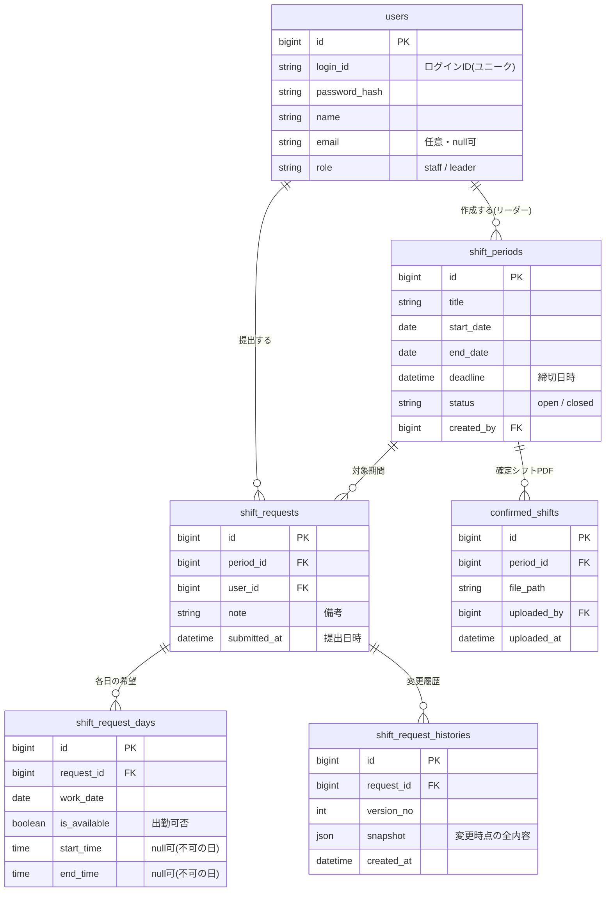

# シフト提出Webサイト データベース設計

> ⚠️ **開発開始時（2026-06-06）のドラフトです。** 実装後に WeeklyFixedShift（固定シフト）・FixedShiftChangeRequest（変更申請）・Announcement 系（アナウンス）などのモデルが追加され、ShiftPeriod にも締切後ポリシー等の列が増えています。最新の正は `shifts/models.py`・`accounts/models.py` と [`../features/`](../features/) です。

> 仕様書（`仕様書.md` v0.2）に基づくテーブル設計。本番DBは **MySQL**（開発は SQLite）を想定。
> 型は概念レベル。実装時にDB製品（MySQL）へ合わせて調整する。

- **作成日**: 2026-06-06
- **バージョン**: 0.1（ドラフト）

---

## 1. 全体像（ER図）

---

## 2. テーブル定義

### 2.1 users（ユーザー）

スタッフ・リーダー共通。アカウントはリーダーが作成する。

| カラム | 型 | NULL | 既定 | 説明 |
| --- | --- | --- | --- | --- |
| id | bigint (PK, AUTO) | × |  | 主キー |
| login_id | varchar(64) | × |  | ログインID。**ユニーク**。リーダーが配布 |
| password_hash | varchar(255) | × |  | ハッシュ化したパスワード（平文保存しない） |
| name | varchar(100) | × |  | 表示名。提出時に自動入力される |
| email | varchar(255) | ○ | NULL | **任意登録**。将来の通知用 |
| role | varchar(16) | × | 'staff' | `staff` / `leader` |
| is_active | boolean | × | true | 無効化フラグ（退職者など） |
| created_at | datetime | × | now() | 作成日時 |
| updated_at | datetime | × | now() | 更新日時 |

- 制約: `UNIQUE(login_id)`

### 2.2 shift_periods（対象期間）

リーダーが作成する募集単位。**複数を同時にopenにできる**。

| カラム | 型 | NULL | 既定 | 説明 |
| --- | --- | --- | --- | --- |
| id | bigint (PK, AUTO) | × |  | 主キー |
| title | varchar(100) | ○ | NULL | 表示名（例:「6/9〜6/15分」） |
| start_date | date | × |  | 対象期間の開始日 |
| end_date | date | × |  | 対象期間の終了日 |
| deadline | datetime | × |  | 提出締切日時 |
| status | varchar(16) | × | 'open' | `open`（募集中）/ `closed`（締切後） |
| created_by | bigint (FK→users.id) | × |  | 作成したリーダー |
| created_at | datetime | × | now() |  |
| updated_at | datetime | × | now() |  |

- 制約: `CHECK(start_date <= end_date)`
- 備考: `status` は締切時刻で自動的に `closed` 扱いにする運用でも、明示フラグでもよい（実装時に決定）。

### 2.3 shift_requests（シフト希望＝提出ヘッダ）

1人が1つの対象期間に対して持つ提出。**(period_id, user_id) で1件**。

| カラム | 型 | NULL | 既定 | 説明 |
| --- | --- | --- | --- | --- |
| id | bigint (PK, AUTO) | × |  | 主キー |
| period_id | bigint (FK→shift_periods.id) | × |  | 対象期間 |
| user_id | bigint (FK→users.id) | × |  | 提出者 |
| note | text | ○ | NULL | 備考・連絡事項 |
| submitted_at | datetime | × | now() | 最新の提出/更新日時 |
| created_at | datetime | × | now() | 初回提出日時 |
| updated_at | datetime | × | now() |  |

- 制約: `UNIQUE(period_id, user_id)`
- 「未提出」= この行が存在しない状態。提出状況一覧では存在しないユーザーを赤表示。

### 2.4 shift_request_days（各日の希望）

1提出につき、対象期間の日数ぶんの行（1日1区間）。

| カラム | 型 | NULL | 既定 | 説明 |
| --- | --- | --- | --- | --- |
| id | bigint (PK, AUTO) | × |  | 主キー |
| request_id | bigint (FK→shift_requests.id) | × |  | 親の提出 |
| work_date | date | × |  | 対象日 |
| is_available | boolean | × | true | 出勤可否。false=その日は出られない |
| start_time | time | ○ | NULL | 開始時刻。`is_available=false` なら NULL |
| end_time | time | ○ | NULL | 終了時刻。同上 |

- 制約: `UNIQUE(request_id, work_date)`
- アプリ側バリデーション: `is_available=true` のとき start/end は必須かつ `start_time < end_time`、`HH:MM` 形式。

### 2.5 shift_request_histories（変更履歴）

締切前にスタッフが内容を変更するたびにスナップショットを残す。リーダー・本人が閲覧。

| カラム | 型 | NULL | 既定 | 説明 |
| --- | --- | --- | --- | --- |
| id | bigint (PK, AUTO) | × |  | 主キー |
| request_id | bigint (FK→shift_requests.id) | × |  | 対象の提出 |
| version_no | int | × |  | 1から連番 |
| snapshot | json | × |  | その時点の各日の希望＋備考の全内容 |
| created_at | datetime | × | now() | 変更日時 |

- 制約: `UNIQUE(request_id, version_no)`
- 設計メモ: 現在の内容は 2.3/2.4 が正。履歴は「いつ・どう変えたか」を見せる目的でJSONスナップショットを保持する（差分計算は表示時にアプリ側で行う）。

### 2.6 confirmed_shifts（確定シフトPDF）

リーダーがアップロードした確定シフト。対象期間に紐づく。

| カラム | 型 | NULL | 既定 | 説明 |
| --- | --- | --- | --- | --- |
| id | bigint (PK, AUTO) | × |  | 主キー |
| period_id | bigint (FK→shift_periods.id) | × |  | 対象期間 |
| file_path | varchar(500) | × |  | 保存先パス / オブジェクトキー |
| original_name | varchar(255) | ○ | NULL | アップロード時のファイル名 |
| uploaded_by | bigint (FK→users.id) | × |  | アップロードしたリーダー |
| uploaded_at | datetime | × | now() |  |

- 複数添付の可否は未決（仕様書セクション14）。
  - 1期間1ファイルなら `UNIQUE(period_id)`、複数可なら付けない。**当面は複数可（制約なし）で設計**し、運用で1ファイルに留めることも可能。

---

## 3. 主要な操作とクエリの考え方

| 操作 | 関連テーブル | メモ |
| --- | --- | --- |
| 提出状況一覧（未提出を赤表示） | users × shift_requests | 対象期間の `shift_requests` を `users`（staff）に LEFT JOIN し、NULL を未提出とする |
| スタッフの希望提出/更新 | shift_requests / shift_request_days / shift_request_histories | 1トランザクションで days を入れ替え、履歴に version 追加 |
| 締切後の提出可否判定 | shift_periods.deadline + shift_requests 有無 | 締切後は「未提出者（行なし）」のみ新規作成可。既存は更新不可 |
| 確定シフト閲覧 | confirmed_shifts | 期間ごとにPDFを表示 |

---

## 4. インデックス（初期案）

- `shift_requests(period_id)` … 期間ごとの一覧
- `shift_requests(user_id)` … 自分の提出履歴
- `shift_request_days(request_id)` … 提出明細の取得
- `shift_request_histories(request_id)` … 履歴表示
- `confirmed_shifts(period_id)` … 期間のPDF取得

---

## 5. 未決・実装時に詰める点

- [ ] `shift_periods.status` を時刻で自動判定するか、明示フラグ＋バッチで切り替えるか
- [ ] 変更履歴の保持はJSONスナップショットでよいか（差分テーブルにするか）
- [ ] 確定シフトPDFの保存先（DB内 / ファイルストレージ / クラウドストレージ）— 技術構成と合わせて決定
- [ ] 論理削除（is_active）か物理削除か。退職スタッフの過去提出をどう残すか
- [ ] パスワードのハッシュ方式（bcrypt / argon2 など）
