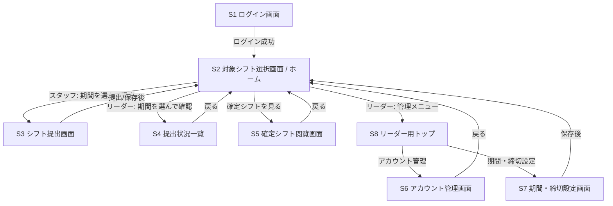

# シフト提出Webサイト 画面設計

> ⚠️ **開発開始時（2026-06-06）のドラフトです。** 実装後に固定シフト関連画面（本人ページ・管理一覧・申請承認）やアナウンス関連画面（一覧・詳細・管理）が追加されています。追加画面は [`../features/`](../features/) を参照してください。

> 仕様書（`仕様書.md` v0.2）・データベース設計（`データベース設計.md`）に基づく画面遷移と各画面の項目整理。
> レイアウトの厳密なデザインではなく、「どの画面に何の項目・操作があるか」を定義する。

- **作成日**: 2026-06-06
- **バージョン**: 0.1（ドラフト）

---

## 1. 画面一覧

| ID | 画面名 | 主なロール |
| --- | --- | --- |
| S1 | ログイン画面 | 全員 |
| S2 | 対象シフト選択画面（ホーム） | 全員 |
| S3 | シフト提出画面 | スタッフ |
| S4 | 提出状況一覧 | リーダー |
| S5 | 確定シフト閲覧画面 | 全員 |
| S6 | アカウント管理画面 | リーダー |
| S7 | 期間・締切設定画面 | リーダー |
| S8 | リーダー用トップ（管理メニュー） | リーダー |
| S9 | 設定（プロフィール）画面 | 全員 |

> S6〜S8 はアプリ内に **Bootstrapで統一した専用画面** として実装する。
> Django標準の管理画面（`/admin`）は、万一のデータ修正用にスーパーユーザー限定で**残す**（普段は専用画面を使う）。

---

## 2. 画面遷移図

- ログインしていない状態で各画面にアクセスした場合は S1 にリダイレクト。
- スタッフがリーダー専用画面（S4/S6/S7）にアクセスした場合は権限エラー or S2 に戻す。

---

## 3. 各画面の詳細

### S1 ログイン画面

- **目的**: ID/パスワードによる認証。
- **対象**: 全員

| 項目 | 種別 | 必須 | 備考 |
| --- | --- | --- | --- |
| ログインID | テキスト入力 | ○ | リーダー配布のID |
| パスワード | パスワード入力 | ○ | マスク表示 |
| ログインボタン | ボタン | - | 認証実行 |

- 操作・挙動:
  - 認証成功 → S2 へ。ロール（staff/leader）に応じて表示メニューを切替。
  - 認証失敗 → エラーメッセージ表示（IDかパスワードが違う旨）。
  - パスワードを忘れた場合の導線: 「リーダーに連絡してください」の案内文（初期版は自動再発行なし）。

---

### S2 対象シフト選択画面（ホーム）

- **目的**: 開いている対象期間の一覧を見て、目的の画面へ遷移する起点。
- **対象**: 全員（ロールで表示メニューが変わる）

| 項目 | 種別 | 備考 |
| --- | --- | --- |
| 対象期間リスト | 一覧 | タイトル・期間（開始〜終了）・締切日時・自分の提出状況を表示 |
| 提出ボタン（各行） | ボタン | スタッフ: S3 へ。提出済みなら「編集」表示 |
| 確認ボタン（各行） | ボタン | リーダー: S4 へ |
| 確定シフトリンク（各行） | リンク | 確定シフトがあれば S5 へ |
| メニュー | ナビ | リーダーのみ: アカウント管理(S6)・期間設定(S7) への導線 |

- 表示ロジック:
  - スタッフ: `open` の期間を中心に表示。各期間に対する自分の提出状況（未提出/提出済み）を表示。
  - 締切を過ぎた期間: スタッフが未提出なら「提出可（締切超過）」、提出済みなら「締切済み・編集不可」と表示。
  - リーダー: 自分が作成した期間を一覧表示（open/closed 両方）。

---

### S3 シフト提出画面

- **目的**: 選択した対象期間に対し、各日の希望（1日1枠）を入力して提出する。
- **対象**: スタッフ

| 項目 | 種別 | 必須 | 備考 |
| --- | --- | --- | --- |
| 期間タイトル/締切表示 | 表示のみ | - | どの期間への提出かを明示 |
| 各日（行） | 繰り返し | - | 対象期間の日数ぶん。日付＋曜日を表示 |
| └ 出勤可否 | トグル/選択 | ○ | 「出勤可」/「不可」 |
| └ 開始時刻 | 時刻入力 | △ | 「出勤可」のとき必須。`HH:MM` |
| └ 終了時刻 | 時刻入力 | △ | 同上。開始 < 終了 |
| 備考・連絡事項 | テキストエリア | 任意 | 出られない日の理由など |
| 提出/保存ボタン | ボタン | - | 締切前のみ有効 |
| 変更履歴を見る | リンク/展開 | - | 過去のバージョン一覧（締切前の編集ぶん） |

- バリデーション:
  - 「出勤可」の日は開始・終了が必須、`HH:MM`形式、`開始 < 終了`。違反は提出不可でエラー表示。
  - 「不可」の日は時刻入力を無効化（空でよい）。
- 挙動:
  - 締切前: 何度でも更新可。更新のたびに変更履歴へスナップショットを追加。
  - 締切後: **未提出だった人のみ**新規提出可。提出済みは閲覧のみ（編集ボタン非活性）。
  - 保存後 → S2 に戻る or 完了メッセージ。

---

### S4 提出状況一覧

- **目的**: リーダーが対象期間の全員の提出状況・内容を一覧で確認する。
- **対象**: リーダー

| 項目 | 種別 | 備考 |
| --- | --- | --- |
| 期間情報 | 表示のみ | タイトル・期間・締切・提出数/全体数 |
| 提出状況テーブル | 表 | 行=スタッフ、列=各日。セルに希望時刻を表示 |
| 未提出の表示 | 強調 | 未提出スタッフの行を**赤く表示** |
| 備考表示 | 表/ツールチップ | 各スタッフの備考を確認できる |
| 変更履歴 | リンク/展開 | 各スタッフの変更履歴を閲覧 |
| エクスポート（任意） | ボタン | 後々: CSV/コピーなど（Excel調整用）。初期版は任意 |

- メモ: 実際の調整作業はExcelで行う（仕様書の業務フロー5）。本画面は「見る」ことに専念。

---

### S5 確定シフト閲覧画面

- **目的**: アップロード済みの確定シフトPDFを閲覧する。
- **対象**: 全員

| 項目 | 種別 | 備考 |
| --- | --- | --- |
| 期間情報 | 表示のみ | どの期間の確定シフトか |
| PDFビューア/ダウンロード | 表示/リンク | アップロードされたPDFを表示・取得 |
| （リーダーのみ）アップロード | ファイル選択+ボタン | PDFをアップロードして確定シフトとして公開 |

- メモ: 複数ファイル添付の可否は未決（当面は複数可で設計）。

---

### S6 アカウント管理画面

- **目的**: リーダーがスタッフのアカウントを作成・編集・無効化する。
- **対象**: リーダー

| 項目 | 種別 | 必須 | 備考 |
| --- | --- | --- | --- |
| アカウント一覧 | 表 | - | 名前・ログインID・メール(任意)・状態 |
| 新規作成 | フォーム | - | 下記項目を入力 |
| └ 名前 | テキスト | ○ |  |
| └ ログインID | テキスト | ○ | ユニーク。配布用 |
| └ メールアドレス | テキスト | 任意 | 将来の通知用 |
| └ ロール | 選択 | ○ | staff / leader |
| 初期パスワード | （自動） | - | 作成時に**自動発行**し、作成後に画面へ一度だけ表示 |
| 編集 | フォーム | - | ID・名前・メール・ロール・状態の変更 |
| パスワード再発行 | ボタン | - | ボタン1つで**自動再発行**し画面に表示 |
| 無効化/有効化 | トグル | - | 退職者などを無効化（is_active） |
| 削除 | ボタン | - | アカウント削除（提出データも一緒に削除）。自分自身・データ作成履歴がある利用者は削除不可 |

---

### S7 期間・締切設定画面

- **目的**: リーダーが対象期間と締切を作成・編集する。複数同時openが可能。
- **対象**: リーダー

| 項目 | 種別 | 必須 | 備考 |
| --- | --- | --- | --- |
| 期間一覧 | 表 | - | タイトル・開始〜終了・締切・状態(open/closed) |
| 新規作成 | フォーム | - | 下記項目 |
| └ タイトル | テキスト | 任意 | 例「6/9〜6/15分」 |
| └ 開始日 | 日付 | ○ |  |
| └ 終了日 | 日付 | ○ | 開始 ≤ 終了 |
| └ 締切日時 | 日時 | ○ | この時刻で締切 |
| └ 締切後の扱い | 選択 | ○ | ①提出・編集不可 ②未提出者のみ提出可・編集不可 ③締切後も編集可 |
| └ 編集最終期限 | 日時 | 任意 | ③のとき、この日時まで編集可（自動）。空なら手動締切まで編集可 |
| └ スタッフに表示 | チェック | - | オフでスタッフのホーム・提出画面から隠す（リーダーは管理画面で操作可） |
| 提出状況 | リンク | - | 各期間の S4 へ（非表示の期間もここから確認可） |
| 締切/募集再開 | ボタン | - | 状態を手動で切り替える（即時クローズ/再開） |
| 表示/非表示 | ボタン | - | スタッフへの表示を切り替える |
| 削除 | ボタン | - | 提出があっても警告のうえ削除可（提出も一緒に削除） |

- バリデーション: `開始日 ≤ 終了日`、`編集最終期限 ≥ 締切日時`。締切後の挙動は「締切後の扱い」に従う。

---

### S8 リーダー用トップ（管理メニュー）

- **目的**: リーダーの管理機能への入口をまとめたメニュー画面。
- **対象**: リーダー

| 項目 | 種別 | 備考 |
| --- | --- | --- |
| アカウント管理へ | リンク/カード | S6 へ。登録スタッフ数を表示してもよい |
| 期間・締切設定へ | リンク/カード | S7 へ。募集中の期間数を表示してもよい |
| 提出状況の確認 | リンク | 各期間の S4 への導線（任意） |
| （補助）Django管理画面へ | リンク | スーパーユーザーのみ表示。`/admin` |

- ホーム（S2）のリーダー用メニューから本画面へ遷移する。

---

### S9 設定（プロフィール）画面

- **目的**: 利用者が自分のメールアドレス登録・パスワード変更を行う。
- **対象**: 全員（スタッフ・リーダー）

| 項目 | 種別 | 備考 |
| --- | --- | --- |
| ログインID | 表示のみ | 変更不可（リーダーのみ管理画面で変更可） |
| メールアドレス | フォーム | 任意。自分で登録・変更できる |
| パスワード変更 | リンク/フォーム | 現在のパスワード＋新パスワード（標準の強度ルール） |

- ナビバーの「設定」から遷移。ヘッダにログインユーザー名・ログアウトと並べて配置。

---

## 4. 共通事項

- **レスポンシブ**: スマホ・PC両対応（スマホ優先で縦並びレイアウト）。
- **ヘッダ/ナビ**: ログインユーザー名・ロール表示・ログアウト。リーダーのみ管理メニュー表示。
- **エラー表示**: フォームはインラインでエラーメッセージ表示。
- **アクセス制御**: 未ログインは S1 へ、権限外画面はブロック。

---

## 5. 未決・後続で詰める点

- [ ] S4 のエクスポート機能の要否・形式（CSV/コピー）
- [ ] 提出時の確認ダイアログの要否
- [ ] スマホでの各日入力UI（縦リスト/カレンダー風など）の具体デザイン
- [ ] ログイン後の初期パスワード変更を強制するか
