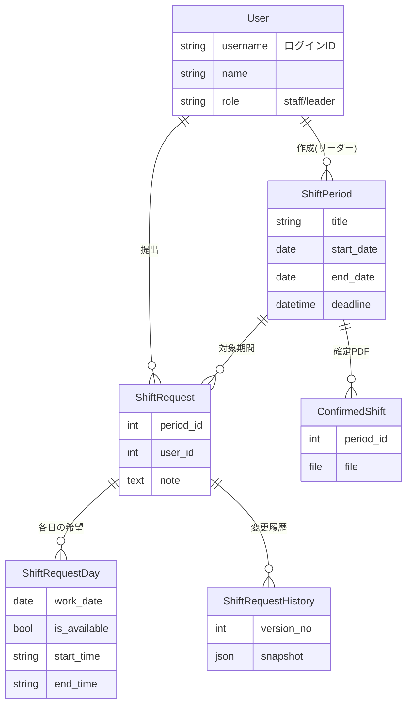
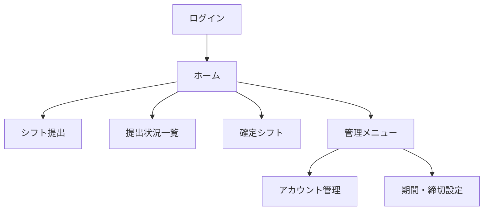

# 0章 要件定義と設計

いきなりコードを書き始めると、途中で「あれも要る」「データの持ち方が違った」と手戻りが多発します。最初に **何を作るか（要件）→ データの形（モデル）→ 画面 → 技術** の順で決めると、実装がスムーズになります。この章では手を動かす前の「設計」を行います。

> 🔰 この章はコードを書きません。ですが、ここで作る設計図がこの先すべての土台になります。

---

## 0-1. 要件定義 ― 何を解決するか

まず「誰の」「どんな困りごとを」解決するのかを1〜2文で書きます。

> アルバイトのシフト希望を、LINEや紙ではなく Web で提出・集約できるようにする。リーダーが全員分を一覧で確認でき、提出期限を明確にする。

次に「登場人物（ロール）」と「やりたいこと（機能）」を箇条書きにします。

**ロール（本講座のコア範囲では2種類）**

- **クルー**: アルバイトスタッフ。シフト希望を出す人。
- **リーダー**: シフトを作る管理者。

**機能（〜できる、の形で書く）**

- クルー: ログインできる／対象期間に各日の希望を提出・編集できる／自分の提出と変更履歴を見られる／確定シフトを見られる
- リーダー: 募集期間と締切を作れる／全員の提出状況を一覧で見られる／確定シフト(PDF)を公開できる／アカウントを作れる

> 💡 **コツ**: 機能は「名詞＋できる」で書くと、そのまま画面や関数に落ちます。「提出できる」→ 提出画面・`submit`ビュー、というように。

---

## 0-2. 用語と業務ルールを決める

認識のズレを防ぐため、言葉と運用ルールを先に固定します。

| 用語 | 意味 |
| --- | --- |
| シフト希望 | クルーが「働きたい時間」を出したもの |
| 対象期間 | 募集の単位（例: ある週の月〜日）。リーダーが開始日〜終了日と締切を設定 |
| 確定シフト | リーダーが調整して確定し、PDFで公開するもの |

**業務ルール（重要な決めごと）**

- シフトの単位は「対象期間（開始日〜終了日）」。リーダーが自由に設定する。
- 1日の入力は**1枠**（開始〜終了の時間帯ひとつ）。時刻は **8:00〜24:00 を30分刻み**で選ぶ。
- 出られない日は「休み」を選べる（時刻入力は不要）。
- 締切前は誰でも提出・編集できる（締切後の扱いは発展編で拡張）。
- 未提出の人は一覧で**赤く強調**する。

> ⚠️ こうした「数字の決め」（30分刻み、8〜24時など）を曖昧にしたまま実装すると後で必ず揉めます。先に決めて文章に残しましょう。

---

## 0-3. データ設計 ― テーブル（モデル）を決める

「保存したいデータ」を表（テーブル）に整理します。Djangoではテーブル1つ＝**モデルクラス1つ**です。

このアプリで保存したいもの:

1. **ユーザー**（クルー／リーダー、ログイン情報）
2. **対象期間**（いつ〜いつ、締切、誰が作ったか）
3. **シフト希望（提出）**（誰が・どの期間に出したか）
4. **各日の希望**（提出の中の、日ごとの出勤可否と時刻）
5. **変更履歴**（提出が編集されたときの記録）
6. **確定シフト**（PDFファイル）

これらの関係を図にすると次のとおりです（`||--o{` は「1対多」を表します）。

設計のポイントを2つだけ押さえます。

- **「提出」と「各日の希望」を分ける**: 1回の提出（`ShiftRequest`）に対し、対象期間の日数分の行（`ShiftRequestDay`）がぶら下がります。これが「1対多」です。月〜日なら提出1件に対し7件の日データ。
- **「未提出」は行が無い状態で表す**: あるクルーがある期間に提出していない＝`ShiftRequest` の行が存在しない、と定義します。これで一覧の「未提出」を素直に判定できます。

> 🔰 時刻 `start_time` / `end_time` を「時刻型」ではなく**文字列 "HH:MM"** で持つ方針にします。理由は「24:00（深夜0時）」を扱いたいため。詳しくは5章で説明します。今は「30分刻みの選択肢から選ぶ文字列」と覚えておけば十分です。

---

## 0-4. 画面設計 ― 画面と遷移を決める

データが決まったら、それを「見せる/入力する」画面を並べます。

| ID | 画面 | 主な利用者 | 役割 |
| --- | --- | --- | --- |
| S1 | ログイン | 全員 | 認証 |
| S2 | ホーム | 全員 | 期間一覧・提出状況の入口 |
| S3 | シフト提出 | クルー | 各日の希望を入力 |
| S4 | 提出状況一覧 | リーダー | 全員×各日の表 |
| S5 | 確定シフト | 全員 | PDF閲覧／（リーダー）アップロード |
| S6 | アカウント管理 | リーダー | クルーの作成・編集 |
| S7 | 期間・締切設定 | リーダー | 期間の作成・編集 |
| S8 | 管理メニュー | リーダー | S6/S7への入口 |

遷移はシンプルです。

> 💡 画面ごとに「誰が見られるか（権限）」を必ず書きます。S4/S6/S7/S8 はリーダー専用。ここを後回しにするとセキュリティ事故のもとです。

---

## 0-5. 技術選定 ― なぜ Django か

| 項目 | 採用 | 理由 |
| --- | --- | --- |
| 言語 | Python | 既習。学習資料が豊富 |
| フレームワーク | **Django** | 認証・管理画面・ORM（DB操作）が標準装備。今回のような「ログイン＋データのCRUD」と相性が良い |
| DB | SQLite（開発） | 設定不要。ファイル1つで動く（本番のMySQL化は発展編10章） |
| 画面 | Django テンプレート + Bootstrap(CDN) | 1フレームワークで完結。CSSを書く負担が小さい |

> 🔰 **Django の考え方（MTV）**: リクエストは「URL → View（処理）→ Model（DB）→ Template（HTML）」と流れます。各章でこの流れを繰り返すので、今は名前だけ覚えておけばOKです。

---

## 0-6. この章のまとめ

- 先に **要件 → データ → 画面 → 技術** を決めた。
- データは6つのモデル。「提出」と「各日の希望」は1対多。「未提出」は行が無い状態で表す。
- 画面は S1〜S8。リーダー専用画面を明確化した。
- 技術は Django + SQLite + Bootstrap。

設計図ができました。次章で開発環境を整え、プロジェクトの骨格を作ります。

➡️ [1章 環境構築とプロジェクト作成](01_環境構築とプロジェクト作成.md)
